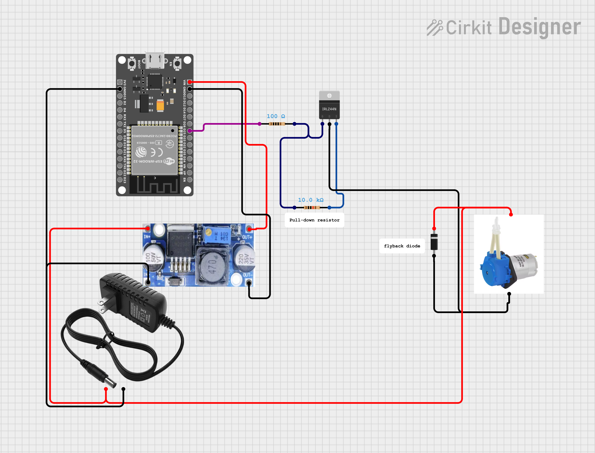
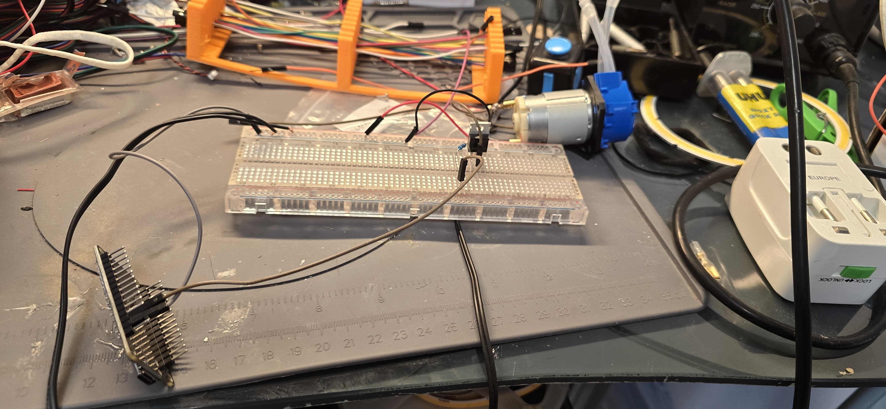
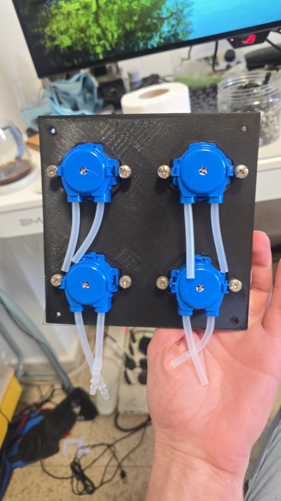
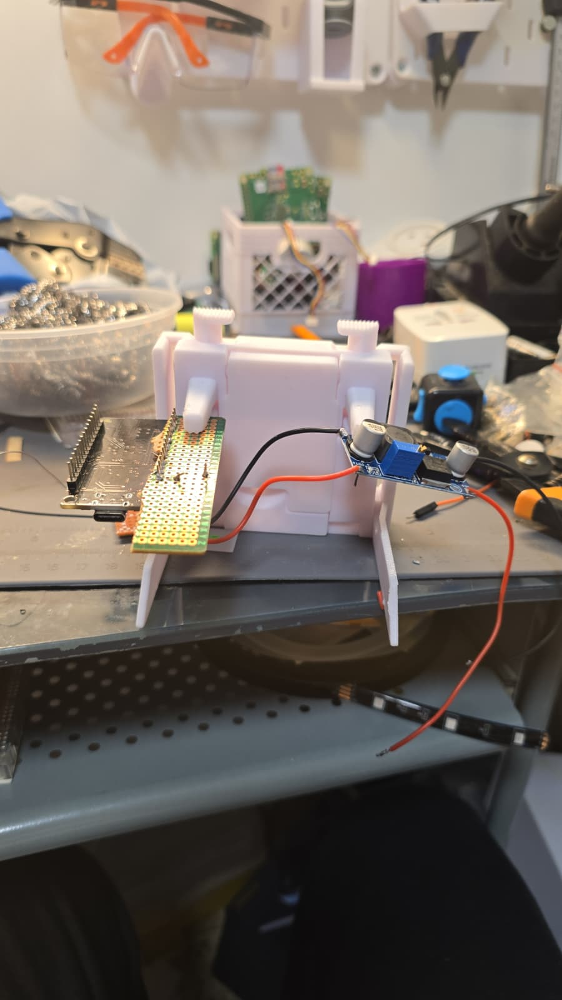
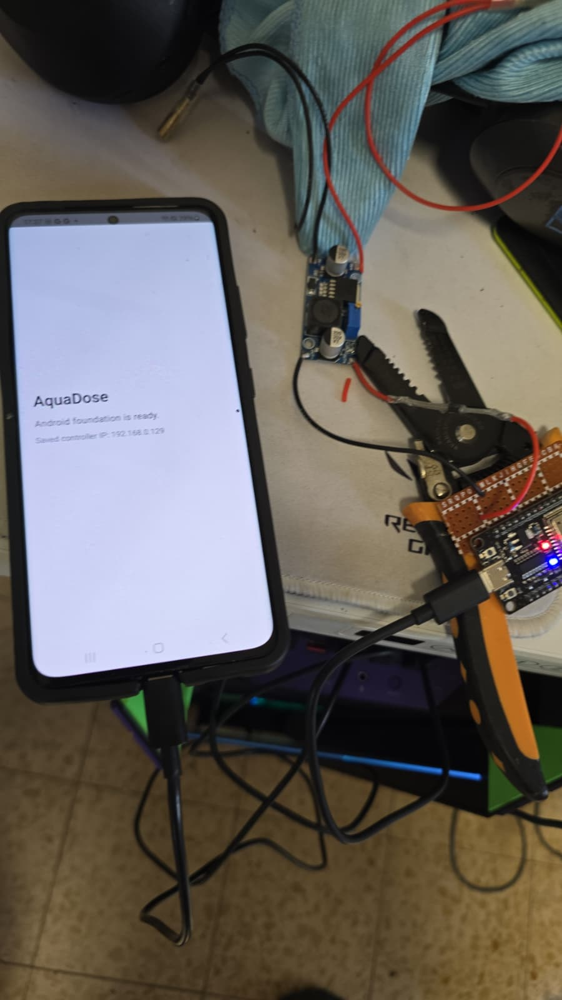

# AquaDose Release

AquaDose is an ESP32-based aquarium dosing controller with a native Android app and a local web interface. It controls up to 8 calibrated peristaltic pumps through external MOSFET driver circuits.

Open [README.html](README.html) in a browser for the full styled guide with screenshots, wiring notes, firmware instructions, Android app flow, troubleshooting, and safety notes. GitHub does not render Bootstrap HTML as a normal README page, so this markdown file is intentionally short.

# AquaDose wiring diagram

The simplified wiring diagram below shows the external MOSFET driver circuit used to control the peristaltic pumps from the ESP32.



## Prototype Photos

These photos show the current AquaDose prototype build, including the controller, wiring, pump layout, and enclosure progress.

<table>
  <tr>
    <td></td>
    <td></td>
  </tr>
  <tr>
    <td></td>
    <td></td>
  </tr>
</table>

## Release Contents

```text
RELEASE/
  README.html
  README.md
  BUILD_NOTES.txt
  apk/
    AquaDose.apk
    SHA256SUMS.txt
  3d-model/
    AquaDose_Case.3mf
  source/
    android/
    arduino/
      AquaDose/
        AquaDose.ino
  docs/
    assets/
      screenshots/
      images/
      prototype/
        circuit_image.png
      3d-model/images/
      vendor/bootstrap/
```

Key files:

- Full styled guide: [README.html](README.html)
- Android APK: [apk/AquaDose.apk](apk/AquaDose.apk)
- Arduino firmware: [source/arduino/AquaDose/AquaDose.ino](source/arduino/AquaDose/AquaDose.ino)
- Android source: [source/android/](source/android/)
- Prototype photos: [docs/assets/prototype/](docs/assets/prototype/)
- Simplified schematic: [docs/assets/prototype/circuit_image.png](docs/assets/prototype/circuit_image.png)
- 3D model download: [3d-model/AquaDose_Case.3mf](3d-model/AquaDose_Case.3mf)

## Quick Install

1. Flash the ESP32 firmware from `source/arduino/AquaDose/AquaDose.ino`.
2. Join the AquaDose setup Wi-Fi network and open `http://192.168.4.1`.
3. Configure Wi-Fi and timezone.
4. Install `apk/AquaDose.apk`.
5. Connect the app to the controller IP.
6. Review the pump list, edit pump names if needed, and confirm GPIO mapping.
7. Prime and calibrate every pump with water.
8. Create schedules only after calibration. Enabled schedule doses must be between 0.1 and 999 ml.
9. Test a small manual dose with water before real aquarium dosing.

## APK

The included APK is a debug build because release signing is not configured in the project.

Verify it with:

```powershell
Get-FileHash -Algorithm SHA256 apk\AquaDose.apk
```

Expected SHA256:

```text
0a0208430aa682fba105903c86acb79431d913eea20efcb863a7b04eb061abcc
```

## Safety

Do not dose aquarium additives until each pump has been wired, primed, calibrated, and tested with water. Wrong wiring or wrong schedule values can harm aquarium livestock.

## Credits

Created by Or Araha  
LinkedIn: [https://www.linkedin.com/in/or-araha-05035aa5/](https://www.linkedin.com/in/or-araha-05035aa5/)
